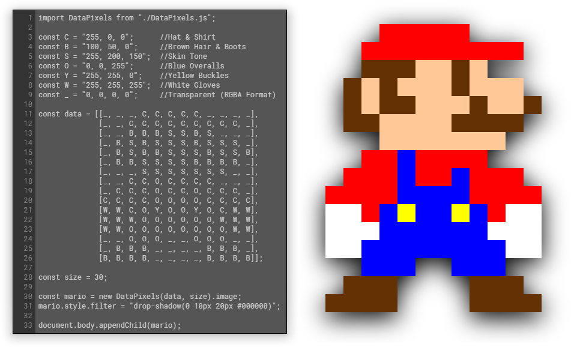
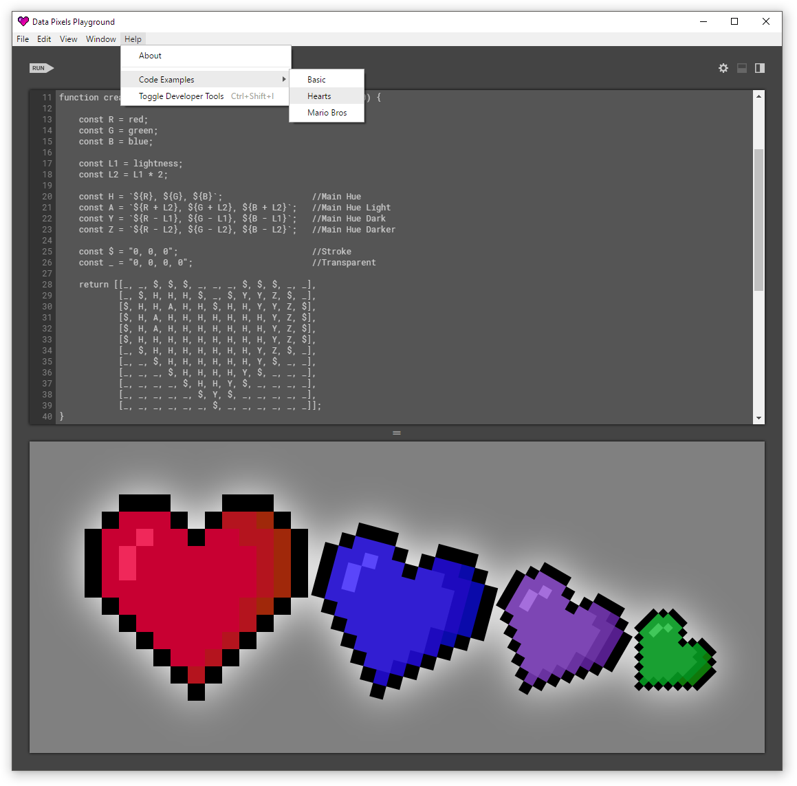

<div align="center">

   
<h1><strong>DATA PIXELS ／ </strong>Create Pixel Art Programmatically</h1>

[](https://www.npmjs.com/package/data-pixels)
[](https://www.npmjs.com/package/data-pixels)
[](https://github.com/gmattie/Data-Pixels/releases)
[](https://github.com/gmattie/Data-Pixels/stargazers)
[](https://github.com/gmattie/Data-Pixels/blob/master/resources/build/license)

</div>

The **DataPixels.js** source code facilitates production of pixel art that is entirely generated programmatically at runtime.   Additionally, the accompanying desktop application, **Data Pixels Playground**, may be used to write and execute code for displaying both customized and automated pixel art.

## **DataPixels.js** 

The DataPixels.js source code features a modular, ES2015 Class design for accessible and effortless construction of new instances.  Each instance contains both **HTMLCanvasElement** and **HTMLImageElement** public accessors whose sources consist of the programmatically generated pixel art.

#### **Install**

DataPixels.js package can be installed as a project dependency from NPM by entering the following CLI command:

```
npm i data-pixels
```

#### **Create**

The DataPixels.js constructor requires 2 arguments:

1. **pixelData**:  An array containing one or more arrays of equal length, consisting of strings composed of 0-255 integer values per 24-bit RGB color channel (e.g., `“255, 255, 255”`) or 32-bit RGBA color channel (e.g., `“255, 255, 255, 255”`).  Additionally, the strings may optionally contain any kind of descriptive text (e.g., `“Red: 255, G - 128, 64 for Blue, Transparency = 32”`) as only the number values within the string will be parsed in RGB / RGBA order.  Strings that contain more than 4 numbers will throw an error.

2. **pixelSize**:  The size of each color data unit in pixels.  This value represents the size of each perceived pixel that forms the pixel art.

For more information see the [**Example Code**](https://github.com/gmattie/Data-Pixels#example-code) section below.



## **Data Pixels Playground**

Data Pixels Playground is a lightweight, cross-platform, desktop application for **Windows**, **Mac** and **Linux**, which may be used to write and execute DataPixels.js instances for previewing and testing purposes.

The application features **built-in example code** via the *Help* menu as well as the ability to **parse pixel data from image files** to produce automatically generated code through the *File > Open Image File…* menu item or through drag-and-drop gestures.

Note: pixel color values that are automatically interpreted from image files with an embedded color space may differ slightly from the image’s intended color values.



## **Desktop Application Release Builds**
Creating release builds for **Windows**, **Mac** and/or **Linux** is a 2-step process: code compilation, then application packaging, both of which are accomplished by running command-line NPM scripts that execute Gulp tasks.

#### **Compilation**

Production code compilation can be executed by entering the following CLI command at the project **root folder** [*~/DataPixels/* ]:

```
npm run prod
```

For more detailed information concerning code compilation please refer to [**Project Foundation**](https://github.com/gmattie/Project-Foundation).

#### **Packaging**

Application packaging can be executed for either all or individual deployment targets by entering one of the following CLI commands at the project **build folder** [*~/DataPixels/resources/build/* ]:

```
npm run package
```

```
npm run package-linux
```

```
npm run package-mac
```

```
npm run package-windows
```

Note: In order to avoid problems with code signing and other build issues it is highly recommended to execute packaging scripts for an individual platform from its own operating system.

For more detailed information concerning application packaging please refer to [**Electron Packager**](https://github.com/electron-userland/electron-packager).

## **Example Code**

#### **Basic**

```javascript
/**
 * @description DataPixels basic code example
 * 
 */
import DataPixels from "data-pixels";

const R = "255, 0, 0, 255";    //Red
const G = "0, 255, 0, 255";    //Green
const B = "0, 0, 255, 255";    //Blue
const _ = "0, 0, 0, 0";        //Transparent

const data = [[R, G],
              [B, _]];

const size = 100;

const dataPixels = new DataPixels(data, size).image;

document.body.appendChild(dataPixels);
```

#### **Hearts**

```javascript
/**
 * @description DataPixels example of multiple heart shaped instances of different hues and rotations
 * 
 */
import DataPixels from "data-pixels";

/**
 * @description Creates a new heart shaped pixelData object of a specified hue
 * @param {number} red - The hue's red value 
 * @param {number} green - The hue's green value
 * @param {number} blue - The hue's blue value
 * @param {number} lightness - The hue's applied value for brightness and darkness
 * 
 */
function createPixelDataHeart(red, green, blue, lightness = 20) {

    const R = red;
    const G = green;
    const B = blue;

    const L1 = lightness;
    const L2 = L1 * 2;

    const H = `${R}, ${G}, ${B}`;           //Main Hue
    const A = `${R+L2}, ${G+L2}, ${B+L2}`;  //Main Hue Light
    const Y = `${R-L1}, ${G-L1}, ${B-L1}`;  //Main Hue Dark
    const Z = `${R-L2}, ${G-L2}, ${B-L2}`;  //Main Hue Darker

    const $ = "0, 0, 0";                    //Stroke
    const _ = "0, 0, 0, 0";                 //Transparent

    return [[_, _, $, $, $, _, _, _, $, $, $, _, _],
            [_, $, H, H, H, $, _, $, Y, Y, Z, $, _],
            [$, H, H, A, H, H, $, H, H, Y, Y, Z, $],
            [$, H, A, H, H, H, H, H, H, H, Y, Z, $],
            [$, H, A, H, H, H, H, H, H, H, Y, Z, $],
            [$, H, H, H, H, H, H, H, H, H, Y, Z, $],
            [_, $, H, H, H, H, H, H, H, Y, Z, $, _],
            [_, _, $, H, H, H, H, H, H, Y, $, _, _],
            [_, _, _, $, H, H, H, H, Y, $, _, _, _],
            [_, _, _, _, $, H, H, Y, $, _, _, _, _],
            [_, _, _, _, _, $, Y, $, _, _, _, _, _],
            [_, _, _, _, _, _, $, _, _, _, _, _, _]];
}

//Create and rotate multiple heart instances of different hues
const redHeart = new DataPixels(createPixelDataHeart(200, 0, 50), 25).canvas;
const blueHeart = new DataPixels(createPixelDataHeart(50, 30, 210), 20).canvas;
const purpleHeart = new DataPixels(createPixelDataHeart(125, 70, 180), 15).canvas;
const greenHeart = new DataPixels(createPixelDataHeart(25, 160, 50), 10).canvas;

let angel = 0;
const rotation = 15;

for (const heart of [blueHeart, purpleHeart, greenHeart]) {

    heart.style.transform = `rotate(${angel += rotation}deg)`;
}

//Create a container to append the heart instances
const container = document.createElement("div");
container.style.filter = "drop-shadow(0 0 30px #FFFFFF)";

container.appendChild(redHeart);
container.appendChild(blueHeart);
container.appendChild(purpleHeart);
container.appendChild(greenHeart);

//Append the container
document.body.appendChild(container);
```

#### **Mario Bros**

```javascript
/**
 * @description DataPixels example of Nintendo's Mario Brothers
 * 
 */
import DataPixels from "data-pixels";

/**
 * @description Creates a Mario or Luigi pixelData object
 * @param {boolean} isMario - Defines the brother's hat and shirt color.  Mario is red and Luigi is green. 
 * 
 */
function createMarioBrother(isMario = true) {

    const mainColor = (isMario) ? "255, 0, 0" : "0, 180, 0";

    const C = mainColor;        //Hat & Shirt
    const B = "100, 50, 0";     //Brown Hair & Boots
    const S = "255, 200, 150";  //Skin Tone
    const O = "0, 0, 255";      //Blue Overalls
    const Y = "255, 255, 0";    //Yellow Buckles       
    const W = "255, 255, 255";  //White Gloves
    const _ = "0, 0, 0, 0";     //Transparent (RGBA Format)

    return [[_, _, _, C, C, C, C, C, _, _, _, _],
            [_, _, C, C, C, C, C, C, C, C, C, _],
            [_, _, B, B, B, S, S, B, S, _, _, _], 
            [_, B, S, B, S, S, S, B, S, S, S, _],
            [_, B, S, B, B, S, S, S, B, S, S, B],
            [_, B, B, S, S, S, S, B, B, B, B, _],
            [_, _, _, S, S, S, S, S, S, S, _, _],
            [_, _, C, C, O, C, C, C, C, _, _, _],
            [_, C, C, C, O, C, C, O, C, C, C, _],
            [C, C, C, C, O, O, O, O, C, C, C, C],
            [W, W, C, O, Y, O, O, Y, O, C, W, W],
            [W, W, W, O, O, O, O, O, O, W, W, W],
            [W, W, O, O, O, O, O, O, O, O, W, W],
            [_, _, O, O, O, _, _, O, O, O, _, _],
            [_, B, B, B, _, _, _, _, B, B, B, _],
            [B, B, B, B, _, _, _, _, B, B, B, B]];
}

//Create and append a Mario Brother instance
const pixelSize = 30;

const brother = new DataPixels(createMarioBrother(true), pixelSize).canvas;
brother.style.filter = "drop-shadow(0 10px 20px #000000)";

document.body.appendChild(brother);
```

## **License**

[**MIT License**](./resources/build/license)

Copyright © 2017-2018 Geoffrey Mattie

